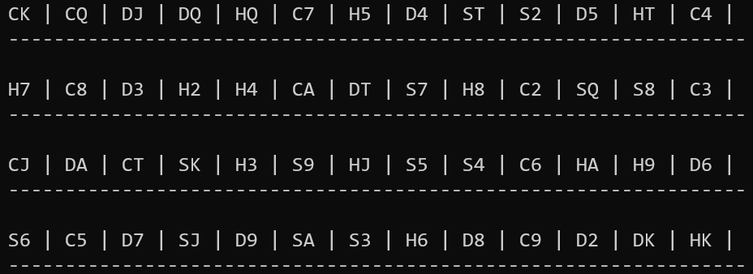
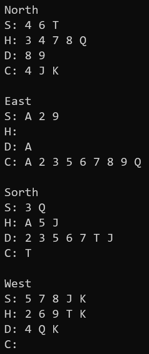
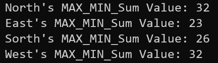

## The **swap()** function

洗牌、排序皆會需要交換卡牌，所以獨立出一個函式模板，增加洗牌、排序函式的可讀性。

```cpp
template <class T>
void swap(T &a,T &b){ //swap using reference
    T temp = a;
    a = b;
    b = temp;
}
```

## The **shuffle()** function

我決定用「隨機抽取兩張牌交換」的方式來打亂整副牌。

```cpp
void shuffle(std::string poker[4][13]){
    srand(time(0));
    int switchTime = rand(); //shuffle random times
```

rand()會產生0到RAND_MAX的整數，我不去管實際上換了幾次牌。

```cpp
    while (switchTime--){ //while (0) stop
        int card1 = rand()%52; //take random two cards and swap
        int card2 = rand()%52;
        swap(poker[card1/13][card1%13],poker[card2/13][card2%13]);
    }
}
```

## The **printDeck()** function

按照題目要求的格式輸出整副牌。

```cpp
void printDeck(std::string poker[4][13]){
    for (int i = 0;i < 4;i++){
        for (int j = 0;j < 13;j++){
            std::cout << poker[i][j] << " | ";
        }
        std::cout << std::endl;
        std::cout << "-----------------------------------------------------------------";
        std::cout << std::endl << std::endl;
    }
}
```

## The **printHand()** function

依照題目要求格式輸出每個人的手牌。

```cpp
void printHand(std::string playerName,std::string player[13]){
    std::cout << playerName << std::endl;
    std::cout << "S: ";
    for (int i = 0;i < 13;i++)
        if (player[i][0] == 'S') //output only with character 'S'
            std::cout << player[i][1] << " ";
    std::cout << std::endl << "H: ";
    for (int i = 0;i < 13;i++)
        if (player[i][0] == 'H') //output only with character 'H'
            std::cout << player[i][1] << " ";
    std::cout << std::endl << "D: ";
    for (int i = 0;i < 13;i++)
        if (player[i][0] == 'D') //output only with character 'D'
            std::cout << player[i][1] << " ";
    std::cout << std::endl << "C: ";
    for (int i = 0;i < 13;i++)
        if (player[i][0] == 'C') //output only with character 'C'
            std::cout << player[i][1] << " ";
    std::cout << std::endl << std::endl;
}
```

## The **deal()** function

前12張牌是有規律的，可以整理成迴圈；最後一張牌的規則較為不同，獨立出來發牌。

```cpp
void deal(std::string poker[4][13],std::string player1[13],std::string player2[13],std::string player3[13],std::string player4[13]){
    for (int i = 0;i < 12;i++){
        player1[i] = poker[i%4][i/4*4];
        player2[i] = poker[i%4][i/4*4+1];
        player3[i] = poker[i%4][i/4*4+2];
        player4[i] = poker[i%4][i/4*4+3];
    }
    //last card has different rule to others, pick at the end
    player1[12] = poker[0][12];
    player2[12] = poker[1][12];
    player3[12] = poker[2][12];
    player4[12] = poker[3][12];
}
```

## The **compare()** function (card version)

兩張牌有非常多花色點數的排列組合，一個一個判斷不好寫，最後改成先評分再比較大小的方式。

- 黑桃：39分

- 紅心：26分

- 方塊：13分

- 梅花：0分

- n點數：(n-1)分

點數最高分數是12分，比起花色的13分，比較結果會是花色的加權比較重，例如：方塊A(13分) > 梅花K(12分)。

```cpp
int compare(const std::string &card1,const std::string &card2){
    int n1 = 0,n2 = 0; //use different points to compare card1 and card2
    switch (card1[0]){ //bigger color has 13 more points
```

利用switch不break會一路往下執行的特性，讓程式更好寫和也更容易讀懂。

```cpp
        case 'S': n1 += 13;
        case 'H': n1 += 13;
        case 'D': n1 += 13;
        case 'C': ;
    }
    switch (card2[0]){
        case 'S': n2 += 13;
        case 'H': n2 += 13;
        case 'D': n2 += 13;
        case 'C': ;
    }
    switch (card1[1]){ //bigger number has 1 more point
        case 'K': n1++;
        case 'Q': n1++;
        case 'J': n1++;
        case 'T': n1++;
        case '9': n1++;
        case '8': n1++;
        case '7': n1++;
        case '6': n1++;
        case '5': n1++;
        case '4': n1++;
        case '3': n1++;
        case '2': n1++;
        case '1': ;
    }
    switch (card2[1]){
        case 'K': n2++;
        case 'Q': n2++;
        case 'J': n2++;
        case 'T': n2++;
        case '9': n2++;
        case '8': n2++;
        case '7': n2++;
        case '6': n2++;
        case '5': n2++;
        case '4': n2++;
        case '3': n2++;
        case '2': n2++;
        case '1': ;
    }
    return n1-n2; //return compare result
}
```

仿造qsort的cmp函式的回傳方式。(兩張牌的評分相減即可)

- card1 > card2：return > 0
- card1 == card2：return 0
- card1 < card2：return < 0

## The **compare()** function (number version)

這也是仿造qsort的cmp函式的回傳方式，差別是用來比較兩個數字的大小。

```cpp
//this overloading function is for comparing int
int compare(const int &a,const int &b){
    return a-b;
}
```

## The **InsertionSort()** function

題目要求的insertion sort函式，把比較大小獨立寫成compare()，交換部分獨立寫成swap()，讓整體程式更易懂。

```cpp
template <class T>
void InsertionSort(T arr[], int n){
    for (int unsortIndex = 1;unsortIndex < n;unsortIndex++){
        for (int currentIndex = unsortIndex;currentIndex > 0;currentIndex--){
            if (compare(arr[currentIndex],arr[currentIndex-1]) < 0)
                //if (current < current-1) then swap()
```

如果current比current-1還要小，就繼續交換，這裡的compare()可以在string和int的不同版本之間overload。

```cpp
                swap(arr[currentIndex],arr[currentIndex-1]);
            else //else break
                break;
        }
    }
}
```

## The **calculateValue()** function

把13張牌的點數單獨存起來，由小排到大再加總。
一定要排序的原因是，有可能一開始就先找到最大或最小，必定要再跑一次迴圈去找第二大或第二小，不如直接排序更省事。

```cpp
int calculateValue(std::string player[13]){
    int value[13] = {0}; //array to store 13 numbers of cards
    for (int i = 0;i < 13;i++){
        switch (player[i][1]){ //convert cards to numbers (ignore colors)
            case 'K': value[i]++;
            case 'Q': value[i]++;
            case 'J': value[i]++;
            case 'T': value[i]++;
            case '9': value[i]++;
            case '8': value[i]++;
            case '7': value[i]++;
            case '6': value[i]++;
            case '5': value[i]++;
            case '4': value[i]++;
            case '3': value[i]++;
            case '2': value[i]++;
            case 'A': value[i]++;
        }
    }
    InsertionSort(value,13); //sort by numbers
    return value[0]+value[1]+value[11]+value[12]; //sum max & min
}
```

## The **main()** function

1. 初始化整副牌、宣告玩家的手牌。

2. 洗牌、印出整復牌、發牌給四位玩家。

3. 把四位玩家的手牌排序、印出。

4. 分別計算四位玩家的點數加總。
   
   ```cpp
   int main() {
    //use "std::string" to store each card is more efficient
    std::string poker[4][13] = {
        "SA","S2","S3","S4","S5","S6","S7","S8","S9","ST","SJ","SQ","SK",
        "HA","H2","H3","H4","H5","H6","H7","H8","H9","HT","HJ","HQ","HK",
        "DA","D2","D3","D4","D5","D6","D7","D8","D9","DT","DJ","DQ","DK",
        "CA","C2","C3","C4","C5","C6","C7","C8","C9","CT","CJ","CQ","CK"
    };
    std::string East[13],Sorth[13],West[13],North[13];
    //use one dimensional array to store each player's hand cards
   
    shuffle(poker); //shuffle whole deck of poker
    printDeck(poker); //print deck with format
    deal(poker,North,East,Sorth,West); //deal out cards to each player
   
    InsertionSort(North,13); //sort each player's hand cards
    printHand("North",North); //and print hand cards with format
   
    InsertionSort(East,13);
    printHand("East",East);
   
    InsertionSort(Sorth,13);
    printHand("Sorth",Sorth);
   
    InsertionSort(West,13);
    printHand("West",West);
   
    //calculate and output max & min sum for each player
    std::cout << "North's MAX_MIN_Sum Value: " << calculateValue(North);
    std::cout << std::endl;
    std::cout << "East's MAX_MIN_Sum Value: " << calculateValue(East);
    std::cout << std::endl;
    std::cout << "Sorth's MAX_MIN_Sum Value: " << calculateValue(Sorth);
    std::cout << std::endl;
    std::cout << "West's MAX_MIN_Sum Value: " << calculateValue(West);
    std::cout << std::endl;
    return 0;
   }
   ```

## 執行結果





