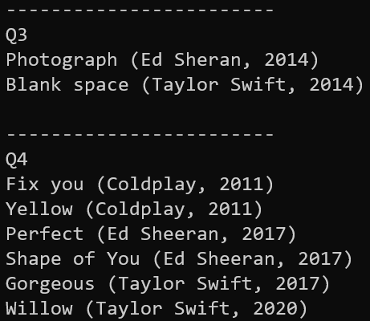

## The **musicSystem** class

- 新增destructor把動態宣告的記憶體釋放
- 把所有參數設成const &，省下local variable的記憶體空間

```cpp
class musicSystem {
  private:
      Song *head;
      Song *tail;

  public:
      musicSystem();
      ~musicSystem();
      void appendNode(const string &, const string &, const int &);
      void insertNode(const string &, const string &, const int &);
      void deleteNodesInRange(const int &, const int &);
      void renameSingerInNode(const string &, const string &);
      void printAllSong() const;
      void reversePrintAllSong() const;
};
```

## The **compareStrings()** function

- 回傳值改成-1、0、1，能夠單純跟0做比較

```cpp
int compareStrings(const string &A, const string &B) {
    if (A < B)
        return -1;
    else if (A == B)
        return 0;
    else //A > B
        return 1;
}
```

<div style="page-break-after: always;"></div>

## The **compareSong()** function

- 簡化insertNode()
- 如果相同再找下一個條件比，否則直接回傳結果

```cpp
int compareSong(const Song *A, const Song *B) {
    if (A->releaseYear == B->releaseYear) {                       //1. releaseYear
        if (A->singer == B->singer)                               //2. singer
            return compareStrings(A->songTitle, B->songTitle); //3. songTitle
        return compareStrings(A->singer, B->singer);
    }
    return A->releaseYear - B->releaseYear;
}
```

## The **destructor** function

1. 如果整個list是空的，就不做事情直接跳出函式

2. 從頭開始，跳到下一首歌，回頭把前一首歌刪掉

3. 跑到最後的時候，直接跳出迴圈了，所以還要把最後一首歌刪掉

4. head和tail設成null pointer

```cpp
musicSystem::~musicSystem() {
    if (head == 0) //if list is empty
        return;
    Song *song = head;
    while (song = song->next) //move forward
        delete song->prev;      //and delete backward
    delete tail;
    head = tail = 0;
}
```

<div style="page-break-after: always;"></div>

## The **appendNode()** function

1. 把designated initializer強制轉型然後直接賦值，節省行數

2. 把正常情況和整個list是空的情況分開處理

```cpp
void musicSystem::appendNode(const string &songTitle, const string &singer, const int &releaseYear) {
    Song *new_song = new Song;
    *new_song = (Song){.songTitle = songTitle, .singer = singer, .releaseYear = releaseYear, .next = 0, .prev = tail};
    if (head == 0) //if list is empty
        head = new_song;
    else //normal condition
        new_song->prev->next = new_song;
    tail = new_song;
}
```

## The **insertNode()** function

1. 先找到插入位置後面的歌

2. 預設是以升序的方式儲存，所以找到比new_song大的即可，如果找不到表示new_song要放在最後一個

3. 如果要放在最後面，交給appendNode()處理；如果要插入在最前面，也要分開處理

```cpp
void musicSystem::insertNode(const string &songTitle, const string &singer, const int &releaseYear) {
    Song *new_song = new Song, *insert_position = head;
    *new_song = (Song){.songTitle = songTitle, .singer = singer, .releaseYear = releaseYear};
    while (insert_position) { //find proper insert position
        if (compareSong(new_song, insert_position) <= 0)
            break;
        insert_position = insert_position->next;
    }
    if (insert_position == 0) { //insert to the back
        appendNode(songTitle, singer, releaseYear);
        return;
    }
    new_song->prev = insert_position->prev; //doesn't matter if the insert condition changes
    insert_position->prev = new_song;
    new_song->next = insert_position;
    if (new_song->prev == 0) //insert to the front
        head = new_song;
    else //normal condition
        new_song->prev->next = new_song;
}
```

## The **deleteNodesInRange()** function

- 遍歷所有歌曲，找到在年份區間就刪掉

- 刪除第一首歌或最後一首歌要分開處理

```cpp
void musicSystem::deleteNodesInRange(const int &start, const int &end) {
    Song *delete_song = head;
    while (delete_song) { //traversal through whole list
        if (delete_song->releaseYear >= start && delete_song->releaseYear <= end) {
            if (delete_song->next == 0) //delete last song
                tail = delete_song->prev;
            else //other condition
                delete_song->next->prev = delete_song->prev;
            if (delete_song->prev == 0) //delete first song
                head = delete_song->next;
            else //other condition
                delete_song->prev->next = delete_song->next;
            delete delete_song;
        }
        delete_song = delete_song->next;
    }
}
```

<div style="page-break-after: always;"></div>

## The **renameSingerInNode()** function

- 遍歷所有歌曲，找到old_name就改成new_name

```cpp
void musicSystem::renameSingerInNode(const string &old_name, const string &new_name) {
    Song *rename_song = head;
    while (rename_song) { //traversal through whole list
        if (rename_song->singer == old_name)
            rename_song->singer = new_name;
        rename_song = rename_song->next;
    }
}
```

## The **printAllSong()** function

- 從head開始印，印完跳到next

```cpp
void musicSystem::printAllSong() const {
    cout << endl;
    Song *song = head;
    while (song) { //traversal through whole list
        cout << song->songTitle << " (" << song->singer << ", " << song->releaseYear << ")" << endl;
        song = song->next;
    }
    cout << endl;
}
```

## The **reversePrintAllSong()** function

- 從tail開始印，印完跳到prev

```cpp
void musicSystem::reversePrintAllSong() const {
    cout << endl;
    Song *song = tail;
    while (song) { //traversal through whole list
        cout << song->songTitle << " (" << song->singer << ", " << song->releaseYear << ")" << endl;
        song = song->prev;
    }
    cout << endl;
}
```

<div style="page-break-after: always;"></div>

## The **main()** function

- 一個一個insert來初始化list

```cpp
int main() {
    // Q1
    musicSystem list;
    list.insertNode("Yellow", "Coldplay", 2011);
    list.insertNode("Photograph", "Ed Sheran", 2014);
    list.insertNode("Shape of You", "Ed Sheran", 2017);
    list.insertNode("Gorgeous", "Taylor Swift", 2017);
    list.printAllSong();
    list.reversePrintAllSong();

    cout << "------------------------" << endl;
    // Q2
    list.insertNode("Blank space", "Taylor Swift", 2014);
    list.insertNode("Fix you", "Coldplay", 2011);
    list.insertNode("Perfect", "Ed Sheran", 2017);
    list.insertNode("Willow", "Taylor Swift", 2020);
    list.printAllSong();

    cout << "------------------------" << endl;
    // Q3
    list.deleteNodesInRange(2013, 2015);
    list.printAllSong();

    cout << "------------------------" << endl;
    // Q4
    list.renameSingerInNode("Ed Sheran", "Ed Sheeran");
    list.printAllSong();

    return 0;
}
```

<div style="page-break-after: always;"></div>

## 執行結果


