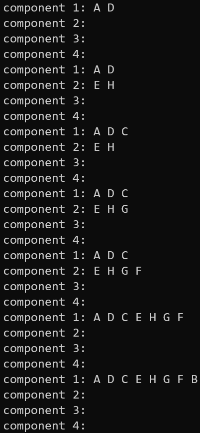
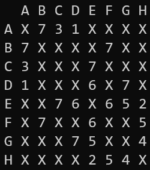
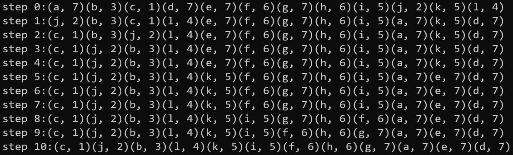
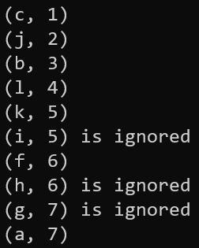

## The **length[]** array

依照線段字母順序排，對應每個線段的長度，可以用字元減法當索引值搜尋。
例如要找`c`的長度可以`length['c'-'a']`=>`length[2]`=>`1`。

```c
//                    a  b  c  d  e  f  g  h  i  j  k  l
const int length[] = {7, 3, 1, 7, 7, 6, 7, 6, 5, 2, 5, 4}; //a array table to query
```

## The **swap()** function

用pass by reference簡化程式。

```c
void swap(struct Edge &e1, struct Edge &e2) {
    struct Edge temp = e1;
    e1 = e2;
    e2 = temp;
}
```

## The **quickSort()** function

1. 把`struct Edge`的陣列拿來排序。

2. 多加`step`紀錄步數。

```c
void quickSort(struct Edge *edges, int left, int right, int &step) {
 if (left >= right)
     return;
 int pivot = right;
 int l = left - 1;
 int r = right;
 while (1) {
     while (l < r && edges[++l].length <= edges[pivot].length)
         ; //find l
     while (r > l && edges[--r].length >= edges[pivot].length)
         ; //find r
     if (l >= r)
         break;
     swap(edges[l], edges[r]);
 }

 swap(edges[pivot], edges[l]);
 printf("step %d:", step++);
 for (int i = 0; i < 12; i++)
     printf("(%c, %d)", edges[i].name, edges[i].length);
 puts("");
 quickSort(edges, left, l - 1, step);  //sort left sub array
 quickSort(edges, r + 1, right, step); //sort right sub array
}
```

## The **findVertex()** function

1. 在已經建立的component裡面搜尋。

2. `index`和`tail`用pass by reference接收。

3. 如果找到，`index`賦值component所在`traversed[]`的索引值，`tail`賦值最後一個node的地址，用來方便新增和合併。

4. 如果沒有找到，`index`賦值`-1`，`tail`賦值`0`。

```c
void findVertex(Node *traversed[4], char vertex, int &index, Node *&tail) {
 for (int i = 0; i < 4; i++) {
     for (Node *currentNode = traversed[i]; currentNode; currentNode = currentNode->next) {
         if (currentNode->vertex == vertex) { //find the vertex traversed
             index = i;
             tail = currentNode;
             while (tail) //move tail to the end of linked list and return
                 if (tail->next)
                     tail = tail->next;
                 else
                     return; //if found assign current index and tail
         }
     }
 }
 index = -1;
 tail = 0; //if not found assign index -1 and tail 0
}
```

## The **print()** function

把component的狀態印出來。

```c
void print(Node *list[4]) {
    for (int i = 0; i < 4; i++) {
        printf("component %d: ", i + 1);
        for (Node *node = list[i]; node; node = node->next)
            printf("%c ", node->vertex);
        puts("0");
    }
}
```

<div style="page-break-after: always;"></div>

輸出結果



<div style="page-break-after: always;"></div>

## The **free()** function

把linked list的空間釋放。

```c
void free(Node *list[4]) {
    for (int i = 0; i < 4; i++) {
        for (Node *node = list[i]; node;) {
            Node *deleteNode = node;
            node = node->next;
            delete deleteNode;
        }
    }
}
```

## The **main()** function

1. 遇到`X`表示沒有連接，有連接會得到該線段的名稱，再用名稱的字元搜尋長度。

2. 照題目要求格式輸出。

```c
int main() {
 //Q1
 puts("  A B C D E F G H");
 for (int i = 0; i < 8; i++) {
     printf("%c ", 'A' + i);
     for (int j = 0; j < 8; j++) {
         if (matrix[i][j] == 'X') {
             printf("X ");
             continue;
         }
         printf("%d ", length[matrix[i][j] - 'a']);
     }
     puts("");
 }
 puts("-------------------------");
```

依照題目要求排序並輸出。

```c
 //Q2
 int step = 0;
 printf("step %d:", step++);
 for (int i = 0; i < 12; i++)
     printf("(%c, %d)", edges[i].name, edges[i].length);
 puts("");
 quickSort(edges, 0, 11, step);
 puts("-------------------------");
```

- 宣告紀錄component的linked list array(我假設連起來才算component，所以最多8/2=4個component)。
- 分為以下幾種情況：
  1. 兩個都找到，且屬於同一個component，`edgeCount`不動，印出ignore訊息。
  2. 兩個都找到，但屬於不同component，`edgeCount+1`，並把兩個component合併在一起。
  3. 只有找到其中一個，`edgeCount+1`，把沒有出現過的點新增在component的後面。
  4. 兩個都沒找到，`edgeCount+1`，找一個空的component把兩個點新增進去。

```c
 //Q3
 Node *traversed[4] = {0}; //declare array to record component
 Node *tail1 = 0, *tail2 = 0;
 int index1 = -1, index2 = -1;
 for (int edgeCount = 0, index = 0; edgeCount < 7; index++) {
     printf("(%c, %d)", edges[index].name, edges[index].length);
     char vertex1 = edges[index].vertex1;
     char vertex2 = edges[index].vertex2;
     findVertex(traversed, vertex1, index1, tail1);
     findVertex(traversed, vertex2, index2, tail2);

     if (tail1) {              //if vertex1 found
         if (tail1 == tail2) { //if vertex1 and vertex2 belong to same component
             puts(" is ignored");
             continue; //if cycle occured, edgeCount won't count
         }

         else if (tail2) { //if vertex1 and vertex2 belong to different component
             tail1->next = traversed[index2];
             traversed[index2] = 0;
         } else { //if vertex1 found and vertex2 not found
             Node *new_node = new Node;
             tail1->next = new_node;
             new_node->vertex = vertex2;
             new_node->next = 0;
         }

     } else {         //if vertex1 not found
         if (tail2) { //if vertex1 not found and vertex2 found
             Node *new_node = new Node;
             tail2->next = new_node;
             new_node->vertex = vertex1;
             new_node->next = 0;
         } else { //if vertex1 and vertex2 both not found
             for (int i = 0; i < 4; i++) {
                 if (traversed[i] == 0) {
                     Node *new_node1 = new Node;
                     Node *new_node2 = new Node;
                     traversed[i] = new_node1;
                     new_node1->vertex = vertex1;
                     new_node1->next = new_node2;
                     new_node2->vertex = vertex2;
                     new_node2->next = 0;
                     break;
                 }
             }
         }
     }
     puts("");
     edgeCount++; //no cycle occured, edgeCount count
 }
 free(traversed); //free linked list
 return 0;
}
```

## 執行結果






