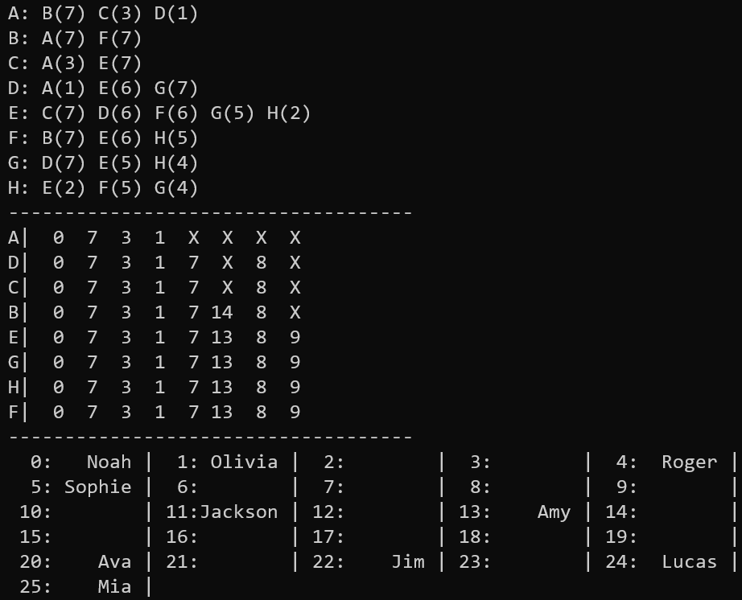

## The **SWAP()** function

這種用xor交換的方式，適合用在整數類型，例如：`int`、`char`等。

```cpp
#define SWAP(a, b) ((a) ^= (b) ^= (a) ^= (b))
```

## The **Edge** class

用來存adjacency list，因此只需要存終點和長度即可，並使用簡單的constructor做初始化。

```cpp
class Edge {
    public:
        char endNode;
        int length;
        Edge *next;

        Edge(char endNode, int length) {
            this->endNode = endNode;
            this->length = length;
            next = 0;
        }
};
```

## The **PriorityQueue** class

每次pop出距離起點最小的點，往外延伸，實作部分後面會解釋。

```cpp
class PriorityQueue {
    public:
        PriorityQueue();
        ~PriorityQueue();
        void push(char);
        char pop();

        int length;
        char *array;
};
```

<div style="page-break-after: always;"></div>

## **Global variable**

- `list`存adjacency list。

- `d`存每個點到起點的距離。

- `name_list`存所有名字。

- `bucket`存雜湊的結果。

```cpp
Edge *list[8] = {0};
int d[8];
const string name_list[] = {"Amy", "Jim", "Olivia", "Noah", "Ava", "Roger", "Sophie", "Jackson", "Lucas", "Mia"};
string bucket[26];
```

## The **read_file()** function

- `%d`、`%c`加上`*`表示讀但不儲存。

- 把`Edge`插入`start`的linked list，並按照中`end`的字典序排列。

```cpp
void read_file() {
  FILE *file = fopen("Graph.txt", "r");
  char start, end, name;
  int length;
  while (fscanf(file, "%*d, %*d, '%c', '%c', %d, '%*c'", &start, &end, &length) != EOF) {
      Edge *current = list[start - 'A'];
      if (current) {
          for (; current->next && current->next->endNode < end; current = current->next)
              ;
          current->next = new Edge(end, length);
      } else {
          list[start - 'A'] = new Edge(end, length);
      }
  }
  fclose(file);
}
```

<div style="page-break-after: always;"></div>

## The **cmp()** function

比較兩的點到起點的距離，-1代表無限。

- `a>b`回傳`>0`

- `a=b`回傳`=0`

- `a<b`回傳`<0`

```cpp
int cmp(const char a, const char b) {
  int d1 = d[a - 'A'];
  int d2 = d[b - 'A'];
  if (d1 == -1 && d2 == -1)
      return 0;
  else if (d1 == -1)
      return 1;
  else if (d2 == -1)
      return -1;
  else
      return d[a - 'A'] - d[b - 'A'];
}
```

## The **Dijkstra()** function

1. 把8個點push進priority queue。

2. 每次把離起點最近的點pop出來，並且更新該點可以連到的距離，按照題目要求輸出one to all的距離。

3. priority queue為空結束。

```cpp
void Dijkstra() {
 PriorityQueue priority_queue;
 for (int i = 0; i < 8; i++)
     priority_queue.push('A' + i);
 char source;
 printf("starting node: ");
 scanf("%c", &source);
 d[source - 'A'] = 0;
 while (priority_queue.length) {
     char node = priority_queue.pop();
     for (Edge *edge = list[node - 'A']; edge; edge = edge->next)
         if (d[edge->endNode - 'A'] == -1 || d[edge->endNode - 'A'] > d[node - 'A'] + edge->length)
             d[edge->endNode - 'A'] = d[node - 'A'] + edge->length;
     printf("%c|", node);
     // printf("%c|", source);
     for (int i = 0; i < 8; i++)
         if (d[i] == -1)
             printf("  X");
         else
             printf(" %2d", d[i]);
     puts("");
 }
}
```

## The **free_list()** function

把adjacency list的空間釋放。

```cpp
void free_list() {
    for (int i = 0; i < 8; i++) {
        for (Edge *deleteEdge = list[i]; deleteEdge; deleteEdge = list[i]) {
            list[i] = list[i]->next;
            delete deleteEdge;
        }
    }
}
```

## The **H1()** function

回傳第一個字母ASCII code mod 26的結果。

```cpp
int H1(string name) {
    return name[0] % 26;
}
```

## The **H2()** function

回傳所有字母ASCII code總和 mod 26的結果

```cpp
int H2(string name) {
    int y = 0;
    for (int i = 0; i < name.length(); i++)
        y += name[i];
    return y % 26;
}
```

<div style="page-break-after: always;"></div>

## The **main()** function

1. 讀檔之後按題目要求輸出adjacency list。

2. 把`d[]`初始化成無限，然後使用Dijkstra演算法，最後釋放adjacency list。

3. 把`H1()`的回傳值當成`index`，如果該`index`不是空字串，表示發生碰撞，用`H2()`重新取`index`。

4. 輸出hash之後的`bucket`。

```cpp
int main() {
 read_file();
 //Q1
 for (int i = 0; i < 8; i++) {
     printf("%c:", 'A' + i);
     for (Edge *current = list[i]; current; current = current->next)
         printf(" %c(%d)", current->endNode, current->length);
     puts("");
 }
 puts("------------------------------------");
 //Q2
 for (int i = 0; i < 8; i++)
     d[i] = -1;
 Dijkstra();
 free_list();
 puts("------------------------------------");
 //Q3
 for (int i = 0; i < 10; i++) {
     int index = H1(name_list[i]);
     if (bucket[index] != "")
         index = H2(name_list[i]);
     bucket[index] = name_list[i];
 }
 for (int i = 0; i < 26; i++) {
     printf(" %2d:", i);
     cout << setw(7) << bucket[i] << " |";
     if ((i + 1) % 5 == 0)
         puts("");
 }
 puts("");
 return 0;
}
```

<div style="page-break-after: always;"></div>

## The **constructor** function

初始化物件。

```cpp
PriorityQueue::PriorityQueue() {
    length = 0;
    array = 0;
}
```

## The **destructor** function

釋放記憶體。

```cpp
PriorityQueue::~PriorityQueue() {
    if (array)
        free(array);
    length = 0;
    array = 0;
}
```

## The **push()** function

擴大`array`大小，直接把新的元素放在多出來的位子。

```cpp
void PriorityQueue::push(char element) {
    array = (char *)realloc(array, sizeof(char) * (length + 1));
    array[length] = element;
    length++;
}
```

## The **pop()** function

類似buble的方式把最小值推到最右邊，縮減`array`的大小接著回傳最小值。

```cpp
char PriorityQueue::pop() {
    for (int i = 1; i < length; i++)
        if (cmp(array[i - 1], array[i]) <= 0)
            SWAP(array[i - 1], array[i]);
    length--;
    char min = array[length];
    array = (char *)realloc(array, sizeof(char) * length);
    return min;
}
```

## 執行結果


